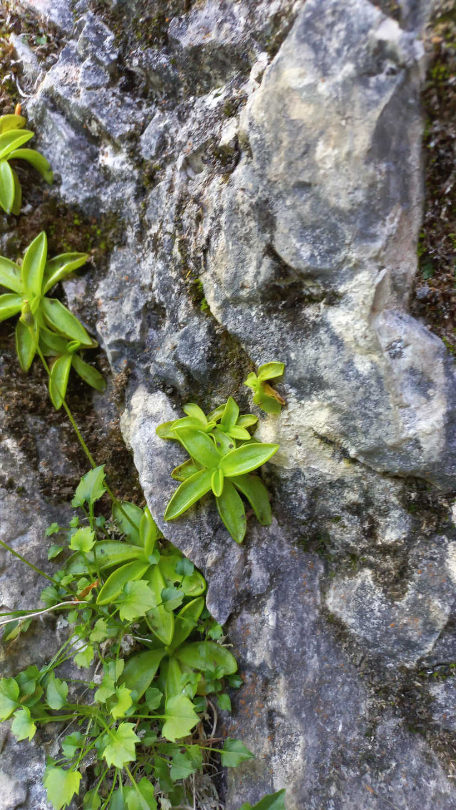

# Tučnica alpínska
- Lat.: Pinguicula alpina
- En.: Alpine Butterwort

Čeľaď: Lentibulariaceae

- Zákonom chránený ohrozený druh
- Stanovisko: Vlhké, mokravé skaly
- Subalpínske až alpínske pásmo

Obs.: July 09, 2023 11:27; Čingov, Slovakia

Zdr:
- https://www.nahuby.sk/atlas-rastlin/Pinguicula-alpina/tucnica-alpinska/tucnice-alpska/ID8214
