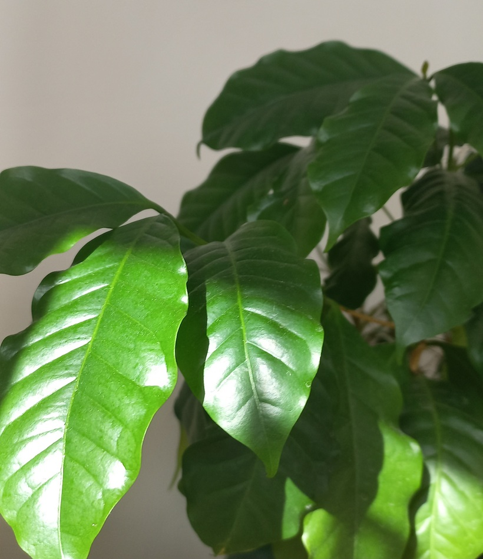

# Kávovník arabský
- Lat.: Coffea arabica
- En.: Arabic coffee

Čeľaď: Rubiaceae

- Jeden z vyše 60 druhov kávovníkov
- Obsahuje menej kofeínu ako *coffea canephora*
- Darí sa mu v domocha bytoch s kúrením - populárna izbová rastlina

Zdr.:
- https://koreninovazahrada.sk/product_info.php/kavovnik-arabsky-p-332