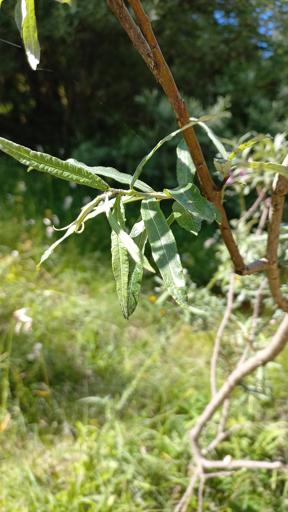

# Vŕba sivá
- Lat.: Salix eleagnos
- En: Bitter willow

Čeľaď: Vŕbovité (Salicaceae) 

- Ker / nízky strom
- Sivá, hladká kôra
- Zvlnené okraje listov
- Rastie v blízkosti vody, 300 - 1200 m.n.m.

Obs.: 9. 7. 2023 Čingov, Slovak Republic

Zdr.: https://www.atlasdrevin.sk/druh/10-vrba-siva