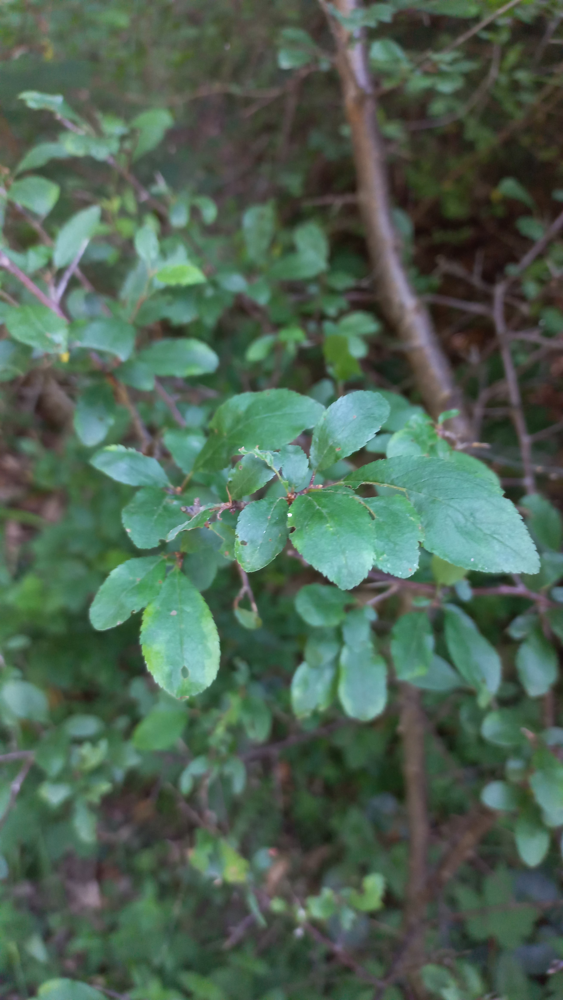

# Slivka trnková
- Lat.: Prunus spinosa L.
- En.: Blackthorn

Čeľaď: Ružovité (Rosaceae)

- 1-4m vysoký ker
- Husto zakonárený
- Trpké plody
- Množstvo brachyblastov

Zdr:
- https://www.atlasdrevin.sk/druh/67-slivka-trnkova-trnka
