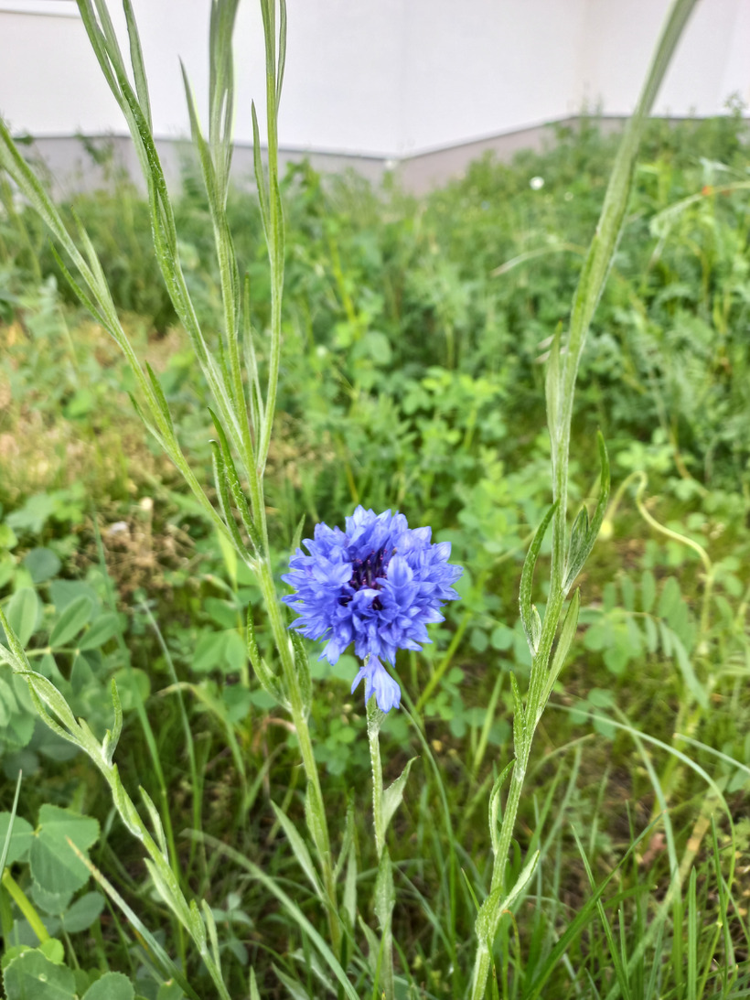

# Gilia
- Lat.: Gilia capitata
- En.: Blue Thimble Flower

- 10-120cm vysoká
- Rastline vyhovuje silné slnko 

Obs.: May 15, 2023 17:05; Slovakia

Zdr.:
- https://www.gardenia.net/plant/gilia-capitata
- https://www.gardenershq.com/Gilia-Thimble-Flower.php
- https://plantlust.com/plants/11661/gilia-capitata/