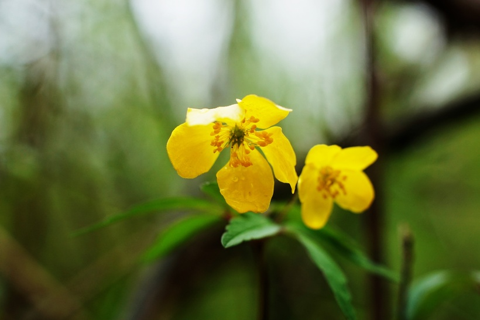

# Veternica iskerníkovitá
- Lat.: Anemonoides ranunculoides
- En.: Buttercup Anemone

Čeľaď: Iskerníkovité (Ranunculaceae)

- Trvalka
- Výška - do 25cm
- Pôda - vlhká, živná
- Rastie v nížinách, často neďaleko vody

Obs.: April 08, 2023 17:40; Slovakia

Zdr.:
- https://www.zahrada-sk.com/e/sk/00077-veternica-iskern%C3%ADkovit%C3%A1-anemone-ranunculoides/