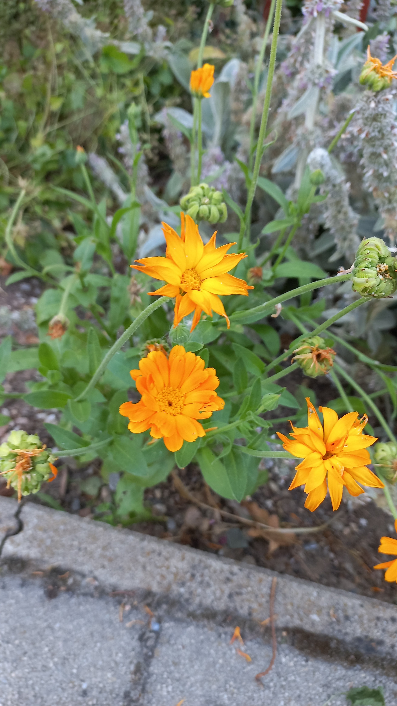

# Nechtík lekársky
- Lat.: Calendula officinalis L.
- En.: Pot Marigold

Čeľaď: Asterovité (Asteraceae)

- Liečivá rastlina
- Letnička
- Výška - 70cm
- Pochádza z južnej Európy

Obs.: July 08, 2023 18:23, Slovakia

Zdr.:
- https://www.zahrada-sk.com/e/sk/00157-necht%C3%ADk-lek%C3%A1rsky-calendula-officinalis/