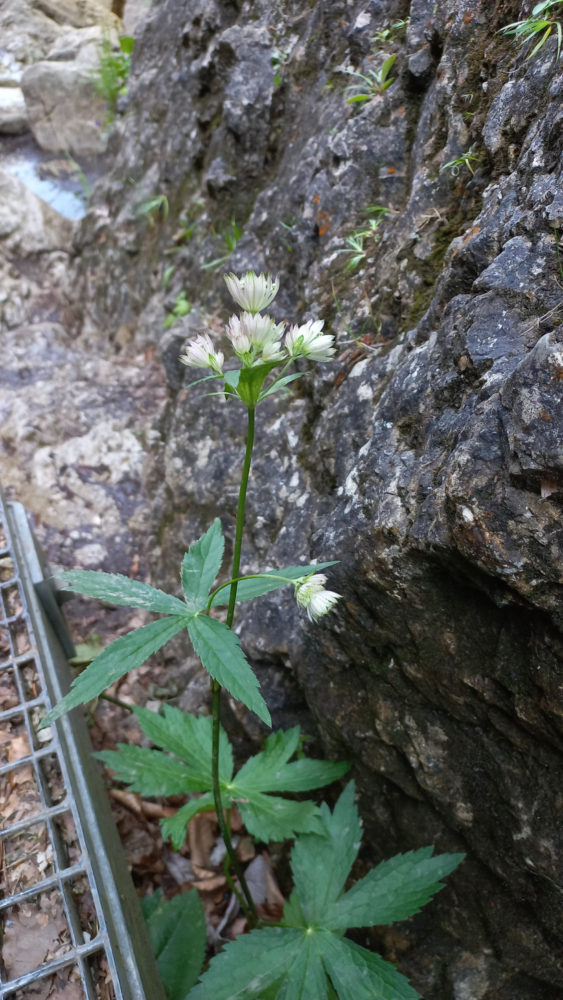

# Jarmanka
- Lat.: Astrantia carniolica
- En.: Carniolan masterwort

Čeľaď: (Apiaceae)

- Endemit južných častí východných Alp
- Kvety umiestnené na dlhých stonkách
- Kvety veľké 2mm

Obs.: July 09, 2023 11:24; Čingov, Slovakia

Zdr:
- https://www.biolib.cz/cz/taxon/id503338/
- https://botany.cz/cs/astrantia-carniolica/
- https://www.nahuby.sk/atlas-rastlin/Astrantia-carniolica/jarmanka/jarmanka/ID15396
