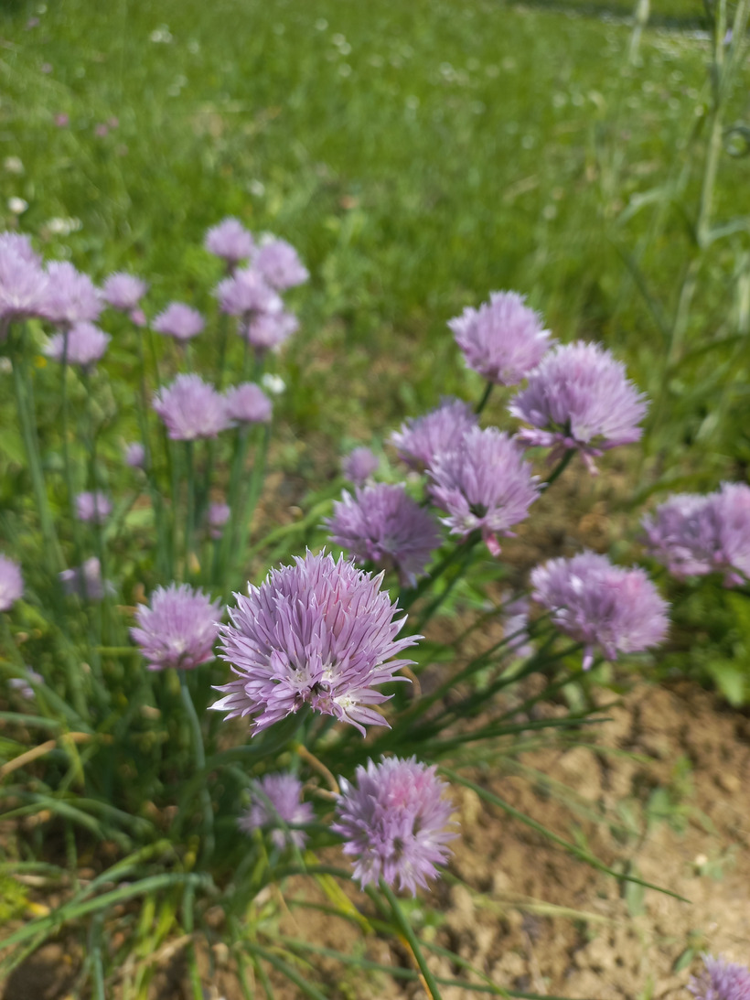

# Cesnak pažítkový
- Lat.: Allium schoenoprasum
- En.: Chives

Čeľaď: Amarilkovité (Amaryllidaceae)

- Trvalá cibuľová bylina
- Mrazuvzdorná
- Rastie v trsoch
- Obsahuje veľa vitamínov a dôležitých látok
- Vyhovuje jej polotieňisté stanovisko

Obs.: May 28, 2023 15:04, Slovakia

Zdr.:
- https://mojerastliny.sk/pazitka/
- https://zdravopedia.sk/zelenina/pazitka-10-ucinkov-na-zdravie