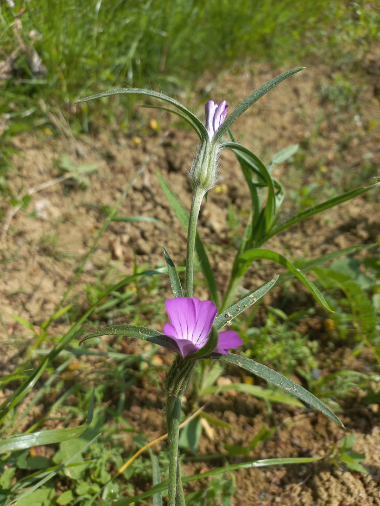

# Kúkoľ poľný
- Lat.: Agrostemma githago
- En.: Common Corncockle

Čeľaď: Silenkovité (Caryophyllaceae)

- Kozmopolitná burina
- Ceľá rastlina je jedovatá
- Rastie ako burina v obilí

Obs.: May 28, 2023 15:05, Slovakia

Zdr.:
- https://portal.nature.cz/publik_syst/nd_nalez-public.php?idTaxon=35138
- https://botany.cz/cs/agrostemma-githago/
- https://powo.science.kew.org/taxon/urn:lsid:ipni.org:names:150316-1