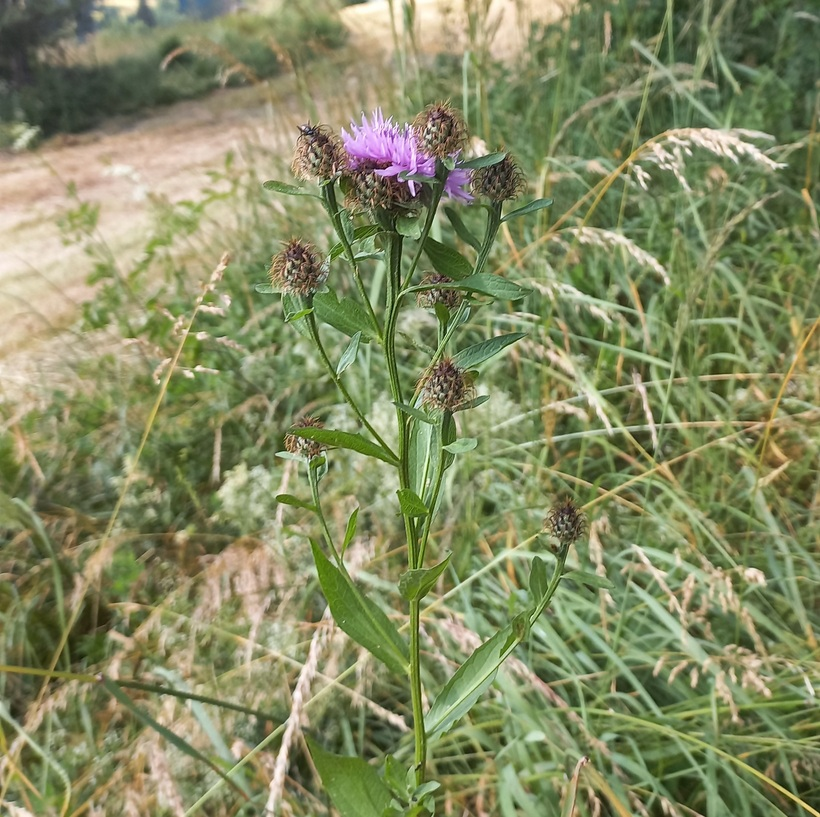

# Nevädza čierna
- Lat.: Centaurea nigra
- En.: Common knapweed

Čeľaď: (Asteraceae)

- 0.3-1.5m vysoká bylina
- Dobrá pre opelovačov (veľa nektáru a peľu)

Obs.: July 09, 2023 15:42; Čingov, Slovakia

Zdr:
- https://pfaf.org/user/Plant.aspx?LatinName=Centaurea+nigra
- https://www.ncbi.nlm.nih.gov/pmc/articles/PMC4920406/
- http://www.efloras.org/florataxon.aspx?flora_id=1&taxon_id=250068128
