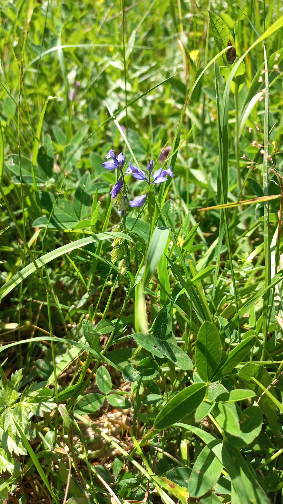

# Horčinka obyčajná
- Lat.: Polygala vulgaris
- En.: Common milkwort

Čeľaď: Polygalaceae

- Výška: 30cm
- Nízka až plazivá bylina
- Fialové kvety v zhlukoch

Obs.: July 09, 2023 12:11; Slovakia

Zdr:
- https://www.wildlifetrusts.org/wildlife-explorer/wildflowers/common-milkwort
- https://botany.cz/cs/polygala-vulgaris/
- https://www.nahuby.sk/atlas-rastlin/Polygala-vulgaris/horcinka-obycajna/vitod-obecny/ID7808