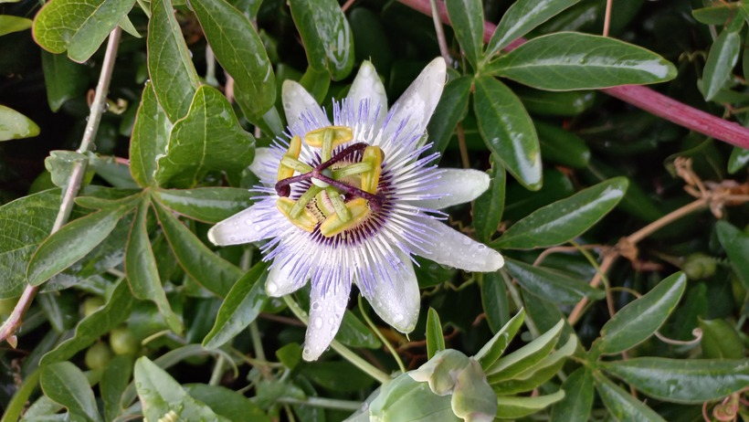

# Múčenka
- Lat.: Passiflora caerulea
- En.: Common passion flower

Čeľaď: Passifloraceae

- Rýchlorastúca popínavá rastlina
- Modro-biele voňavé kvety
- 3cm dlhé žlto-orandžové bobule

Obs.: August 28, 2023 20:16; France

Zdr:
- https://www.cabidigitallibrary.org/doi/10.1079/cabicompendium.116172
- https://www.zahrada-plantex.sk/izbove-rastliny/passiflora-caerulea-mucenka/
