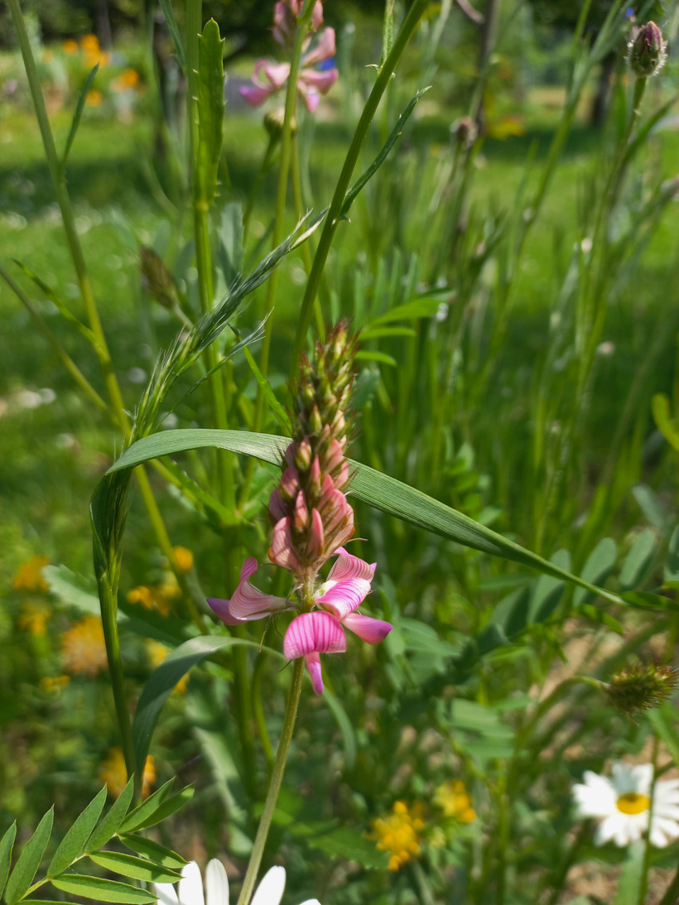

# Vičenec vikolistý
- Lat.: Onobrychis viciifolia
- En.: Common sainfoin

Čeľaď: Bôbovité (Fabaceae)

- 30-60cm trváca bylina
- Natívny v juhovýchodnej Európe až západnej Ázii
- Preferuje suchšie stanoviská, slnečné lúky

Obs.: May 28, 2023 15:04; Slovakia

Zdr:
- https://botany.cz/cs/onobrychis-viciifolia/
- https://www.osiva-semena.sk/vicenec-vikolisty-onobrychis-viciifolia-semena-50-ks