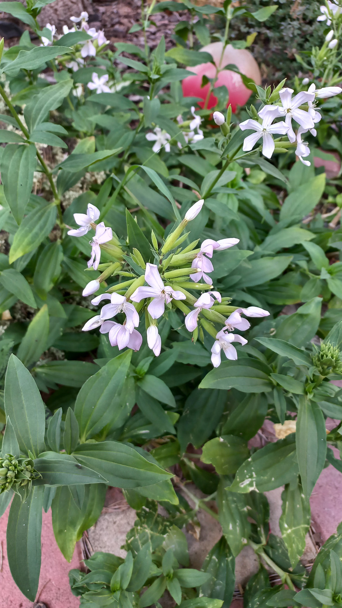

# Mydlica lekárska
- Lat.: Saponaria officinalis
- En.: Common soapwort

Čeľaď: Hvozdíkovité (Caryophyllaceae)

- 50cm trváca bylina
- Rastie v celej Európe
- Preferuje vlhkú pôdu na okrajoch ciest a pri vodných tokoch

Obs.: July 09, 2023 18:29; Slovakia 

Zdr:
- https://botany.cz/cs/saponaria-officinalis/
- https://www.prirodaplus.sk/zive-bylinky-a-rastlinky-v-kvetinacoch/mydlica-lekarska-saponaria-officinalis-l