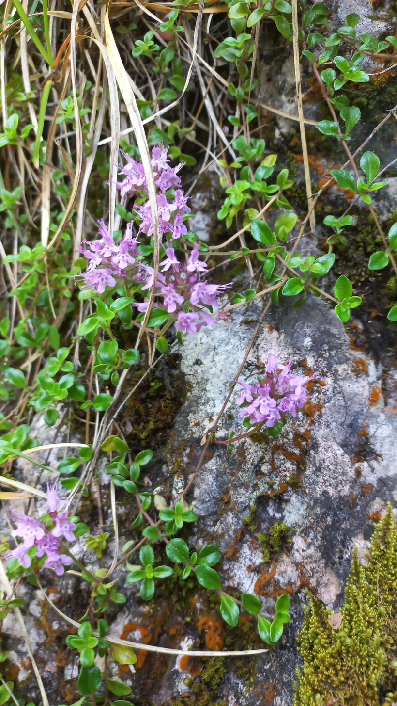

# Dúška materina
- Lat.: Thymus serpyllum
- En.: Creeping thyme

Čeľaď: Hluchavkovité

- Liečivá rastlina
- Pochádza zo stredomoria
- Obsahuje voňavé silice

Zdr.:
- https://mediteka.sk/materina-duska/
- https://zdravopedia.sk/prirodna-lekaren/bylinky/materina-duska