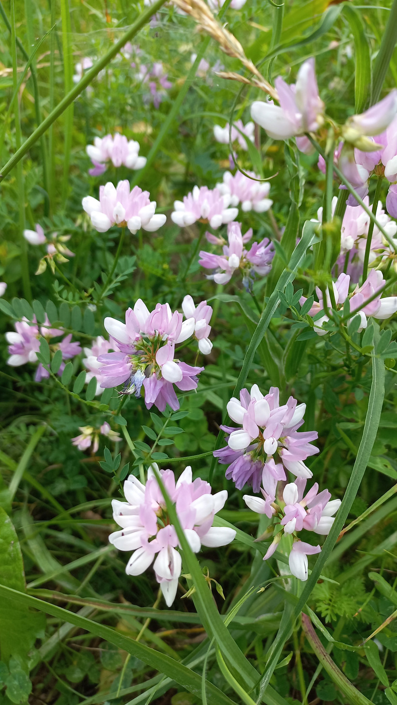

# Ranostaj Pestrý
Lat.: Securigera varia
En.: Crownvetch

Čeľaď: Bôbovité (Fabaceae)

- Rastie veľmi rýchlo
- Stala sa inváznou rastlinou
- Je toxická pre kone

Zdr.:
- https://www.in.gov/dnr/files/Crown_vetch.pdf
- https://plants.sc.egov.usda.gov/home/plantProfile?symbol=SEVA4