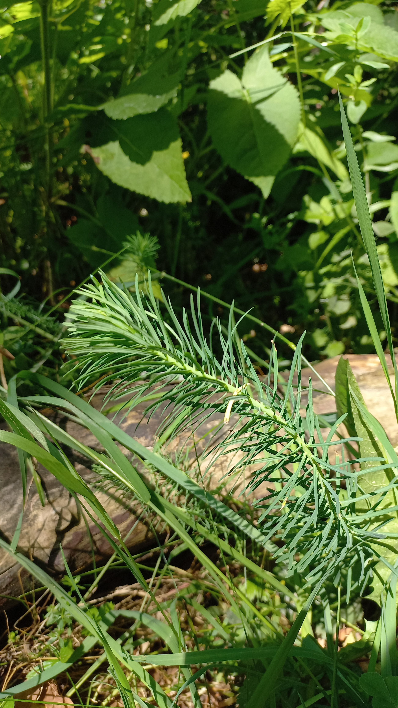

# Mliečnik chvojkový
- Lat.: Euphorbia cyparissias
- En.: Cypress sprunge

Čeľaď: Mliečnikovité (Euphorbiaceae)

- 20-40cm trváca bylina
- Drevnatá stonka a podzemok
- Plody explodujú až 5m do prostredia

Zdr.:
- https://mojerastliny.sk/mliecnik-chvojkovy/