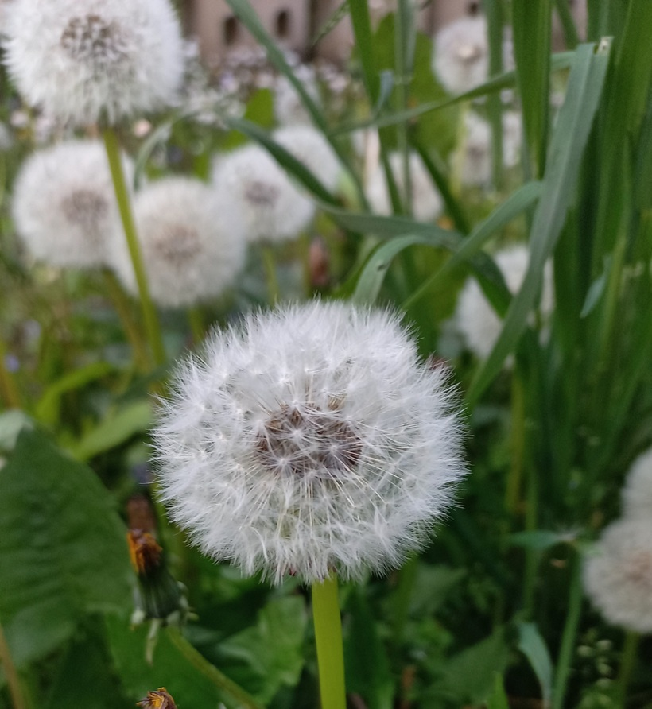
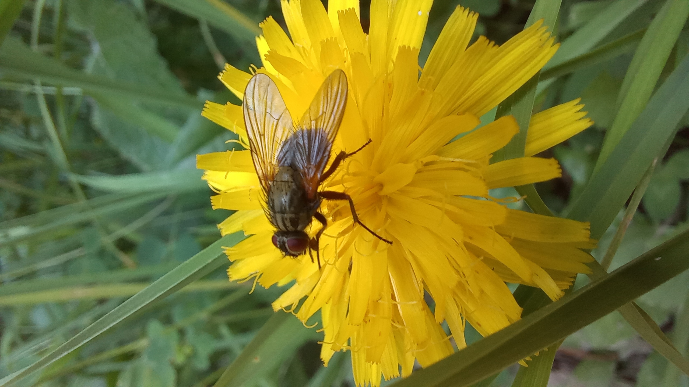

# Púpava lekárska
- Lat.: Taraxacum officinale
- En.: Dandelion

Opelovači

Čeľaď: Astrovité (Asteraceae)

- Nízka bylina
- Listy (5-40cm) v prízemnej ružici
- Stonka má len 1-2.5cm
- Stvol 5-50cm
- Koreň môže dorastať až do hĺbok 1-2m
- Široké spektrum ekologickej valencie
- Efektívna distribúcia semien vetrom

Obs.: July 09, 2023 10:55; Slovakia

Zdr.: 
- https://www.cabidigitallibrary.org/doi/10.1079/cabicompendium.52773
