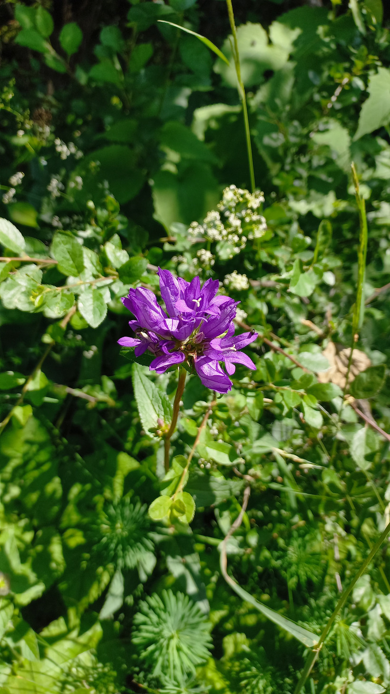

# Zvonček klbkatý
- Lat.: Campanula glomerata
- En.: Dane's Blood

Čeľaď: Zvončekovité (Campanulaceae)

- Vytrvalá 10-70cm bylina
- Stanovisko - suchšie, okraje lesov, lesostepi
- Rozšírenie: Európa, Severná Amerika

Zdr.:
- https://botanika.wendys.cz/index.php/14-herbar-rostlin/451-campanula-glomerata-zvonek-klubkaty
- https://botany.cz/cs/campanula-glomerata/
- https://www.botanickafotogalerie.cz/cz/Campanula_glomerata/