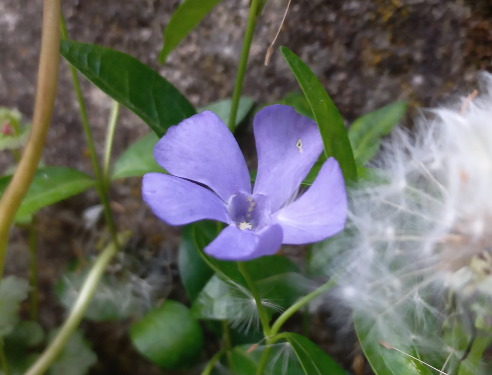

# Zimozeleň Menšia
- Lat.: Vinca minor
- En.: Common Periwinkle

Čeľaď: Zimozeleňovité (Apocynaceae)

- Plazivá stonka
- Listy v zime neopadávajú
- Celá rastlina je jedovatá (alk. [Vinkamín](https://sk.wikipedia.org/wiki/Vinkam%C3%ADn))

Obs.: 10. 5. 2023 Nitra, Slovak Republic

Zdr.: https://mojerastliny.sk/zimozelen-mensia/