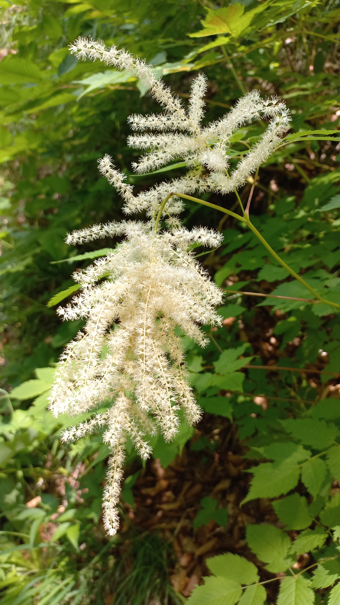

# Udatník lesný
- Lat.: Aruncus dioicus
- En.: Goat's beard

Čeľaď: Ružovité (Rosaceae)

- Trvalá bylina
- 0.5-1.5m
- Vrcholová metlina má drobné jednopohlavné kvety
- Výskyt: Horské lesy

Zdr.: https://mojerastliny.sk/udatnik-lesny/