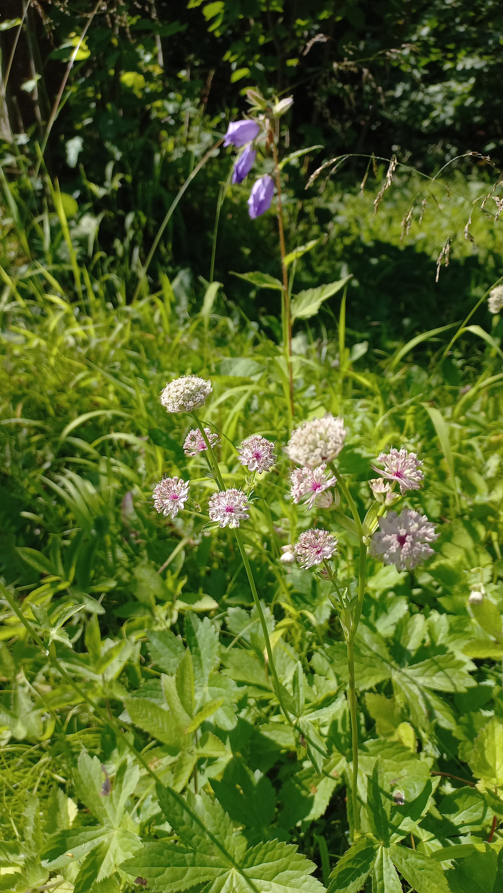

# Jarmanka väčšia
- Lat.: Astrantia major
- En.: Great masterwort

-Čeľaď: Mrkvovité (Apiaceae)

- Opelované včelami, muchami a inými chrobákmi
- Pôvod - Európa, západná Ázia
- Výška - do 50cm

Zdr.:
- https://hort.extension.wisc.edu/articles/astrantia-astrantia-major/