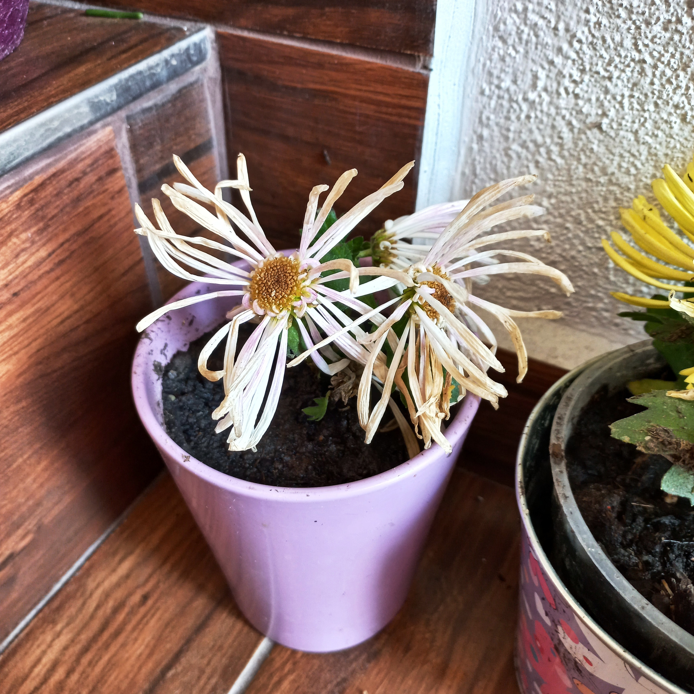

# Chryzantéma záhradná
- Lat.: Chrysanthemum × morifolium
- En.: Hardy Garden Mum
- Cn.: 菊花

Čeľaď: Astrovité (Asteraceae)

- Hybrid
- Kvitnú v októbri
- V Číne tento druh existoval už v roku -500

Zdr.:
- https://www.finegardening.com/plant/hardy-garden-mum-chrysanthemum-morifolium
- https://mojerastliny.sk/chryzantema-zahradna/