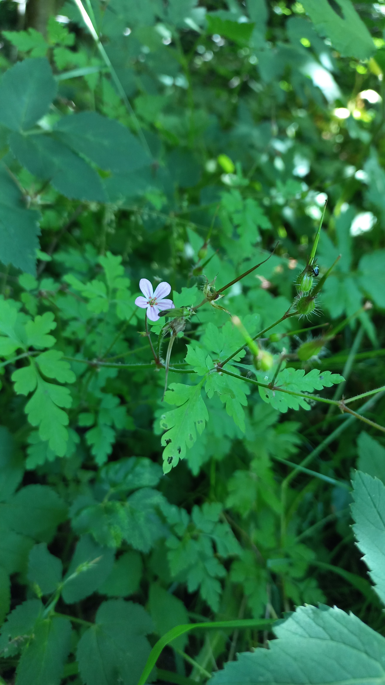

# Pakost smradľavý
- Lat.: Geranium robertianum
- En.: herb-Robert

- Čeľaď: Pakostovité (Geraniaceae)

Zdr.:
- https://www.nahuby.sk/atlas-rastlin/Geranium-robertianum/pakost-smradlavy/kakost-smrduty/ID8275
- https://www.zahrada-sk.com/forum/vt/sk/11566-pakost-smrad%C4%BEav%C3%BD-geranium-robertianum/