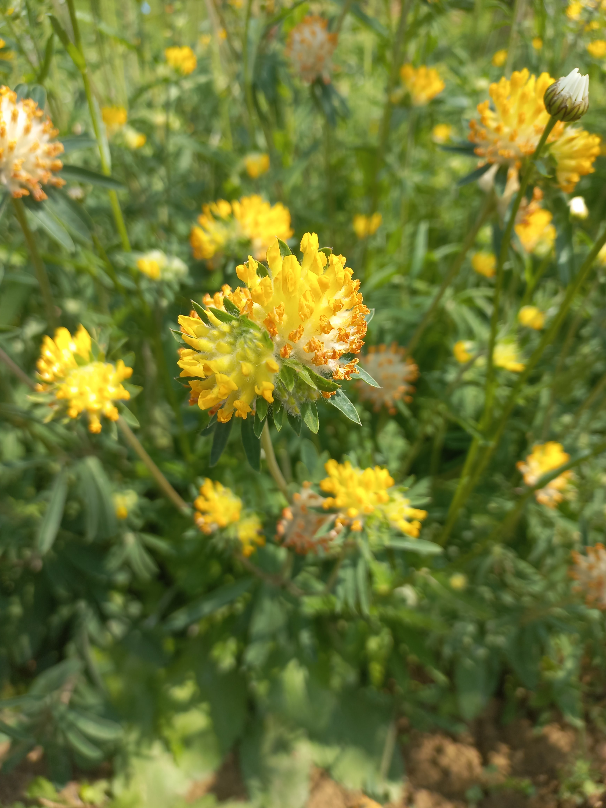

# Bôľhoj lekársky
- Lat.: Anthyllis vulneraria
- En.: Kidney Vetch

Čeľaď: Bôbovité (Fabaceae)

- Z jedného koreňa sa rozrastajú desiatky výhonkov
- Liečivá rastlina
- Do 30cm

Zdr.:
- https://www.wildlifetrusts.org/wildlife-explorer/wildflowers/kidney-vetch