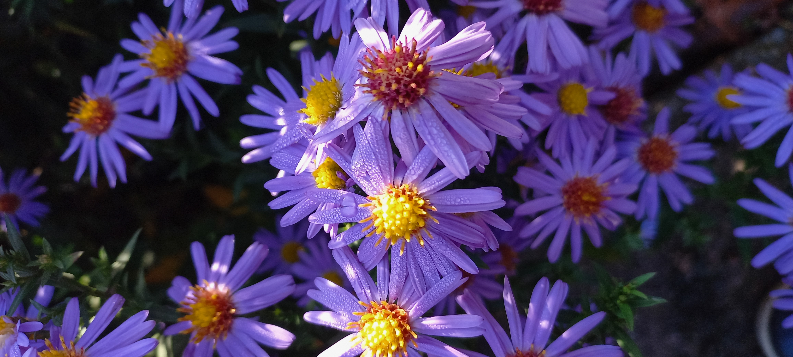

# Astra kopcová
- Lat.: Aster amellus
- En.: Michaelmas Daisy

Čeľaď: Astrovité (Asteraceae)

- Často sa pestuje v záhonoch
- Vyhovujú jej zásadité pôdy
- Výška: do 1m

Zdr.: https://www.rastlinky.sk/aster-amellus-veilchenkonigin-astra-kopcova-k9.html
