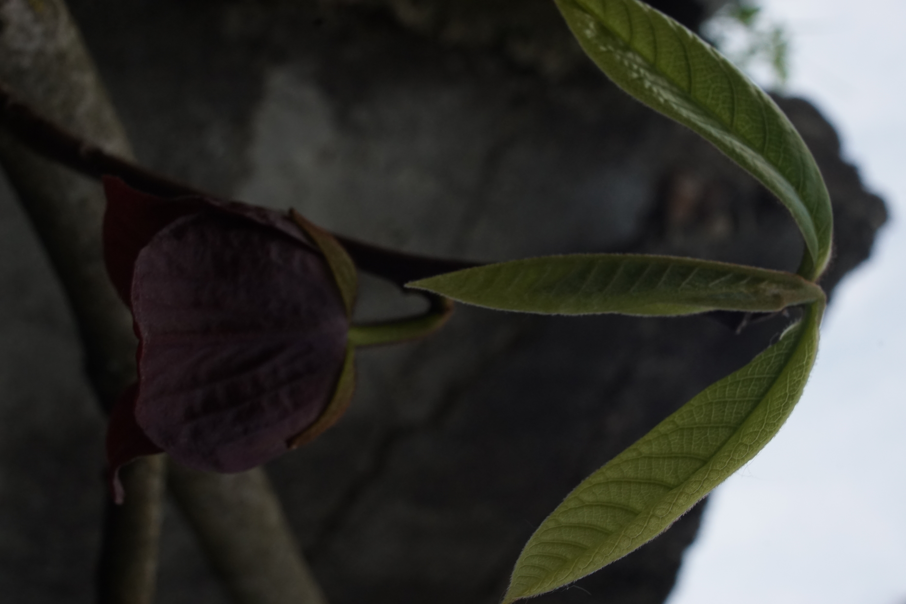

# Pawpaw
- Lat.: Asimina Triloba
- En.: Pawpaw

Čeľaď: Anonovité (Annonaceae)

- Cudzoopelivá rastlina
- Opelenie - muchy a vietor
- Mrazuvzdorná do -25°C

Zdr.:
- https://www.rastlinky.sk/blog/paw-paw-asimina-triloba-l-navod-na-pestovanie.html