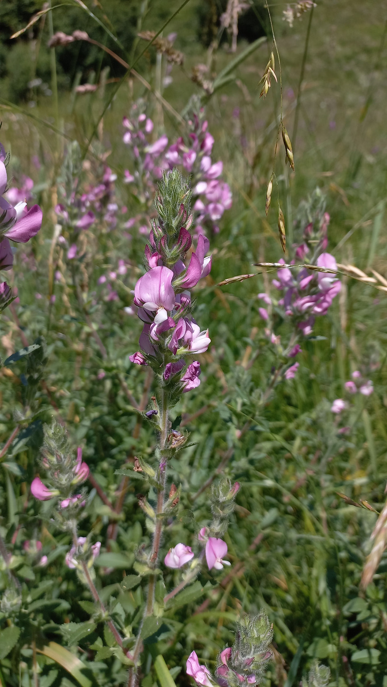

# Ihlica roľná
- Lat.: Ononis arvensis
- En.: Field restharrow

Čeľaď: Bôbovité (Fabaceae)

- Vytrvalá, 30-60cm vysoká bylina
- Suchšie lúky, okraje ciest, pastviny
- Ohrozený druh

Zdr:
- https://www.nahuby.sk/atlas-rastlin/Ononis-arvensis/ihlica-rolna/jehlice-rolni/ID10302
- https://botany.cz/cs/ononis-arvensis/