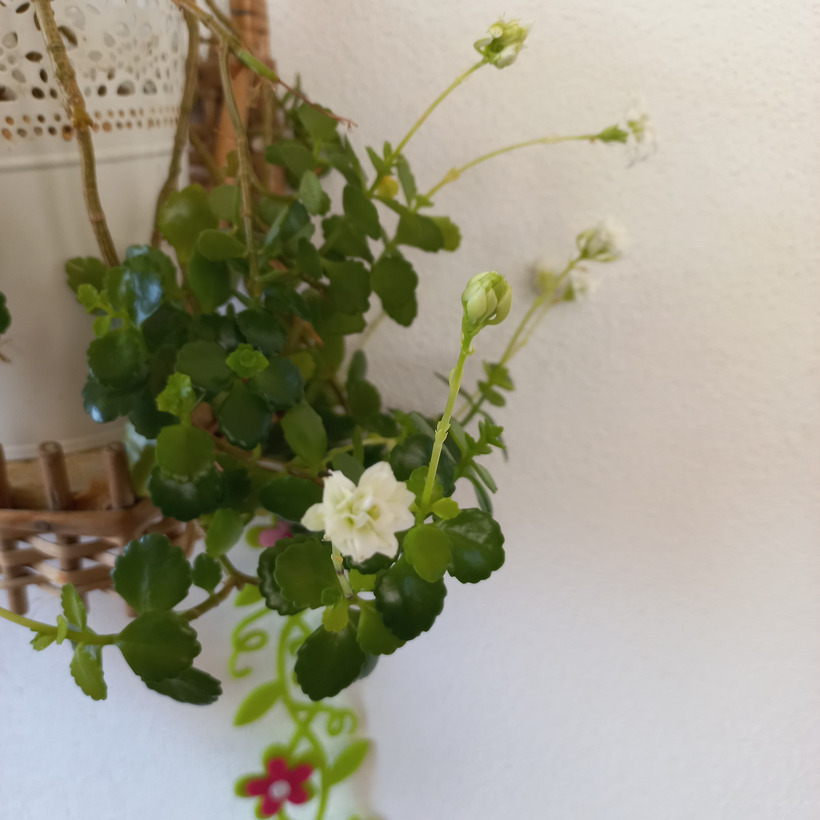

# Kalanchoe
- Lat.: Kalanchoe blossfeldiana
- En.: Flaming Katy

Čeľaď: Tučnolistovité (Crassulaceae)

- Sukulent
- Záhradná aj interiérová rastlina
- Nenáročná na pestovanie
- Môže byť jedovatá pre domáce zvieratá

Zdr.:
- https://www.nasdomov.sk/kalanchoe/
- https://domadoma.sk/ako-pestovat-kalanchoe/
- https://domavi.sk/kalanchoe/
- https://mojerastliny.sk/kalanchoe/