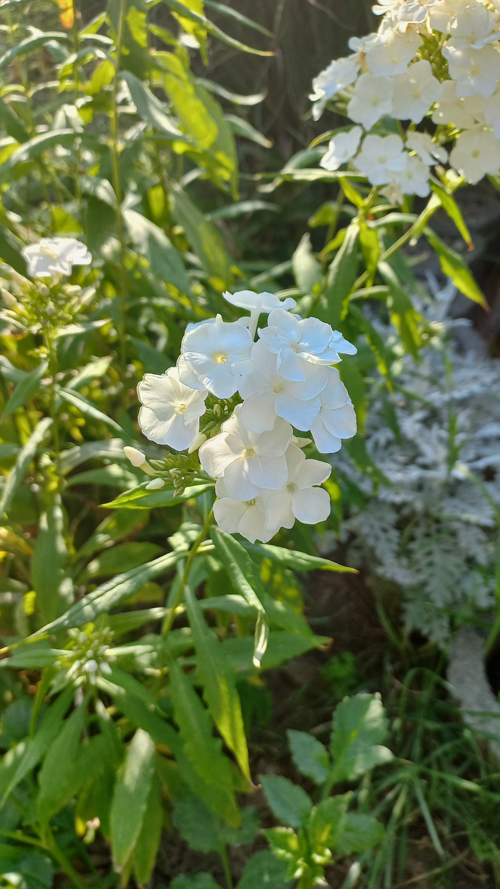

# Flox záhradný
- Lat.: Phlox paniculata
- En.: Garden phlox

Čeľaď: Polemoniaceae

- Trvalka pochádzajúca z Ameriky
- Tvorí tuhé vzpieravé stonky
- Kvety sú výrazne voňavé

Zdr:
- https://www.slovensketrvalky.sk/produkt/phlox-paniculata-white-eye-flame