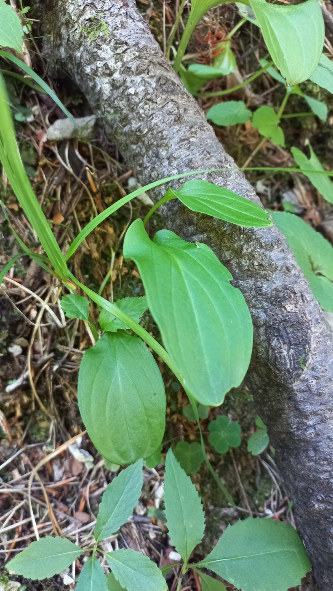

# Bielokvet močiarny
- Lat.: Parnassia palustris
- En.: Grass of parnassus

Čeľaď: Jesencovité (Celastraceae)

- Vytrvalá bylina s bielimi kvetmi
- Výskyt: Severná a stredná Európa
- Rastie na vlhkých lúkach, rašeliniskách a okrajoch lesov

Zdr:
- https://botany.cz/cs/parnassia-palustris/