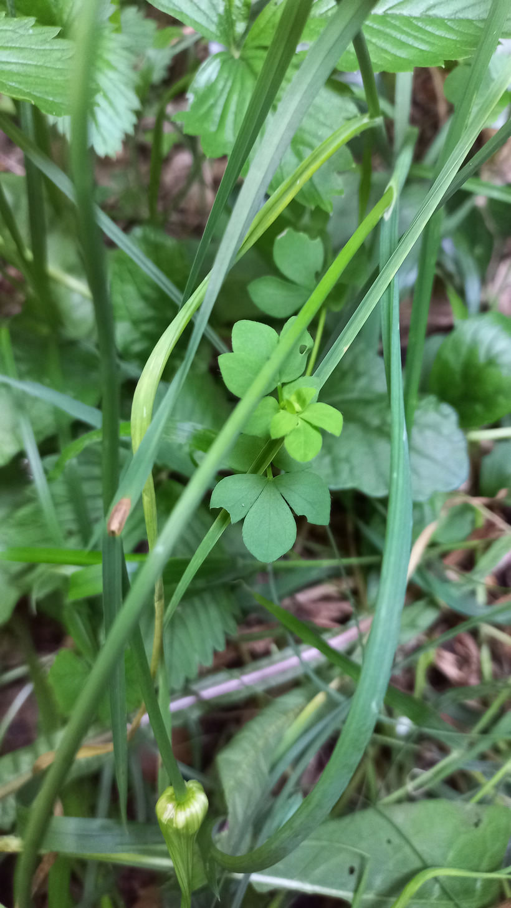

# Štírovník bažinný
- Lat.: Lotus pedunculatus
- En.: Greater bird's-foot-trefoil

Čeľaď: Bôbovité (Fabaceae)

- 30-50cm bylina
- Rastie na rašeliniskách, vlhkých lúkach a v prítomnosti vodných tokov
- Silne ohrozený chránený druh
- 

Zdr.:
- https://www.first-nature.com/flowers/lotus-pedunculatus.php
- https://www.nahuby.sk/atlas-rastlin/Lotus-uliginosus/ladenec-barinny/stirovnik-bazinny/ID7678
- https://pladias.cz/taxon/overview/Lotus%20pedunculatus