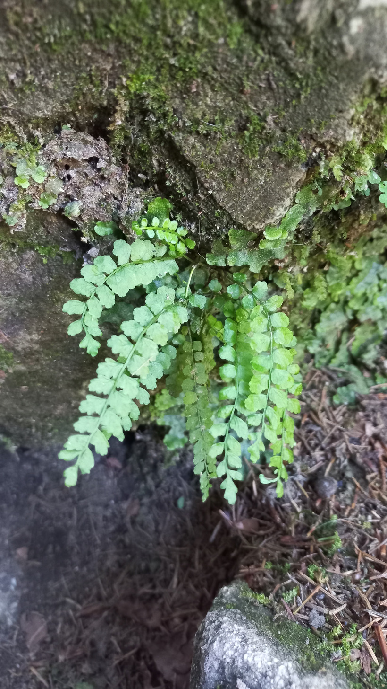

# Slezinník zelený
- Lat.: Asplenium viride
- En.: Green spleenwort

Čeľaď: Slezinníkovité (Aspleniaceae)

- Drobná papraď
- Preferuje vlhké stanovisko
- Často na vápencových skalách

Zdr.:
- https://www.nahuby.sk/atlas-rastlin-zoznam-vedecky?type=celad&value=Aspleniaceae
- https://www.nahuby.sk/atlas-rastlin/Asplenium-viride/slezinnik-zeleny/slezinik-zeleny/ID9830