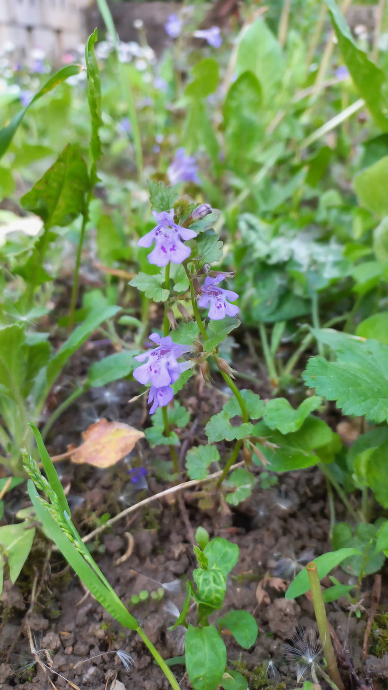

# Zádušník brečtanovitý
- Lat.: Glechoma hederacea
- En.: Ground Ivy

Čeľaď: Hluchavkovité (Lamiaceae)

- Trváca bylina
- Vysoká 10-40cm
- Pochádza z Európy a Ázie

Zdr.:
- https://liecivebyliny.sk/zadusnik-brectanovity-lat-glechoma-hederacea-l/
- https://mojerastliny.sk/zadusnik-brectanovity/