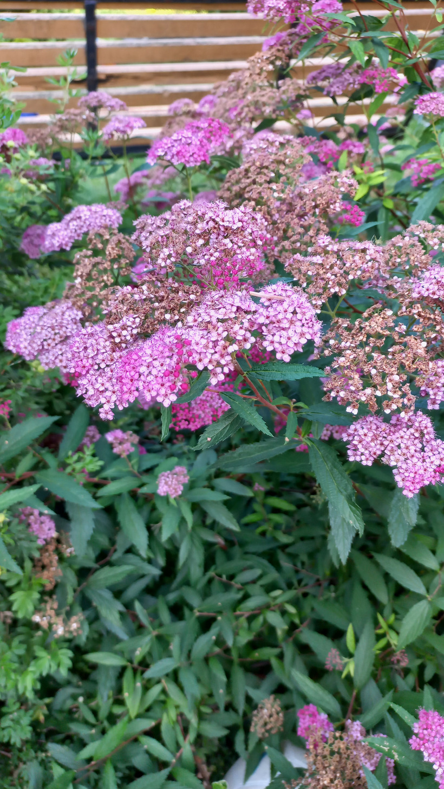

# Tavoľník japonský
- Lat.: Spiraea japonica
- En.: Japanese spiraeae

Čeľaď: Ružovité (Rosaceae)

- Nízky opadavý ker
- Mrazuvzdorný
- Dorastá do výšky 1m

Zdr.:
- https://mojerastliny.sk/tavolnik-japonsky/