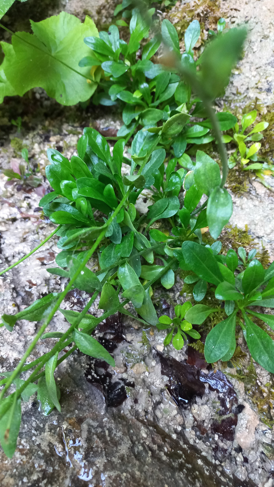

# Vápnička skalná
- Lat.: Kernera saxatilis
- En.: Kernera

Čeľaď: Brukvovité (Brassicaceae)

- Vytrvalá 10-30cm bylina
- Rastie na vápencových skalách
- V nadmorských výškach 850-2700 m.n.m.

Zdr.:
- https://botany.cz/cs/kernera-saxatilis/