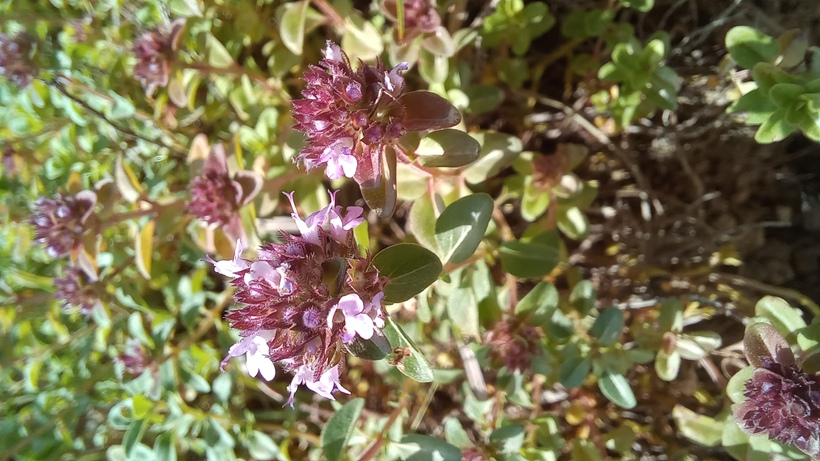

# Dúška vajcovitá
- Lat.: Thymus pulegioides
- En.: Large thyme

Čeľaď: Lamiaceae

- Rastie na kamenitých pastvinách
- Obsahuje aromatické silice
- Často vyrastá na mraveniskách lúčnych mravcov

Zdr:
- https://www.nahuby.sk/atlas-rastlin/Thymus-pulegioides/duska-vajcovita/materidouska-vejcita/ID8704
- https://botany.cz/cs/thymus-pulegioides/