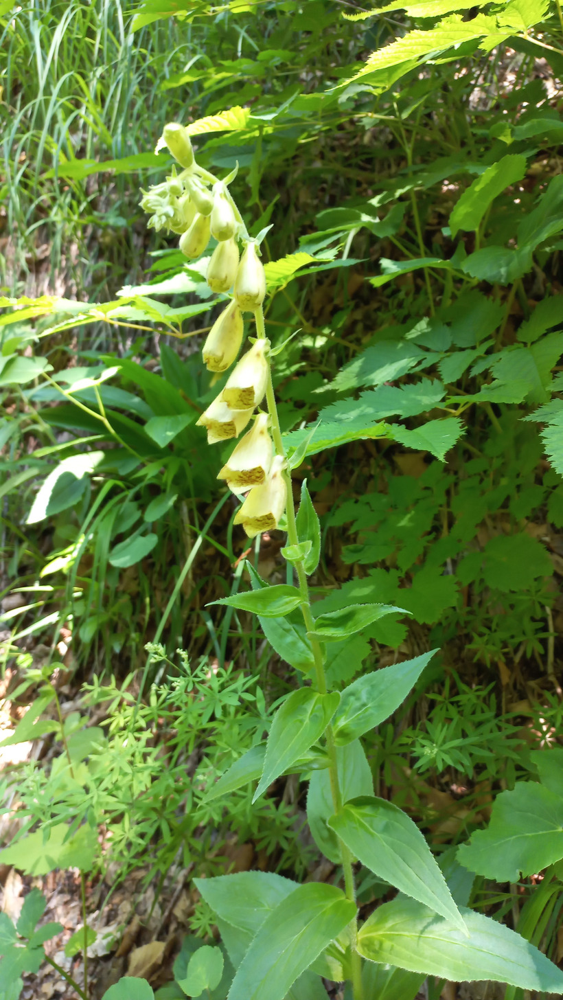

# Náprstník veľkokvetý
- Lat.: Digitalis grandiflora
- En.: Large yellow foxglove

Čeľaď: 

- Prvý rok tvorí listovú ružicu, druhý kvitne
- Rastie na slnečných stanoviskách
- Obsahuje jedovaté látky

Zdr:
- https://www.nahuby.sk/atlas-rastlin/Digitalis-grandiflora/naprstnik-velkokvety/naprstnik-velkokvety/ID7797
- https://www.zahradnictvospomysl.sk/naprstnik-velkokvety-carillon-digitalis-grandiflora-carillon--/
- https://www.rastlinky.sk/digitalis-grandiflora-naprstnik-velkokvety-k9.html