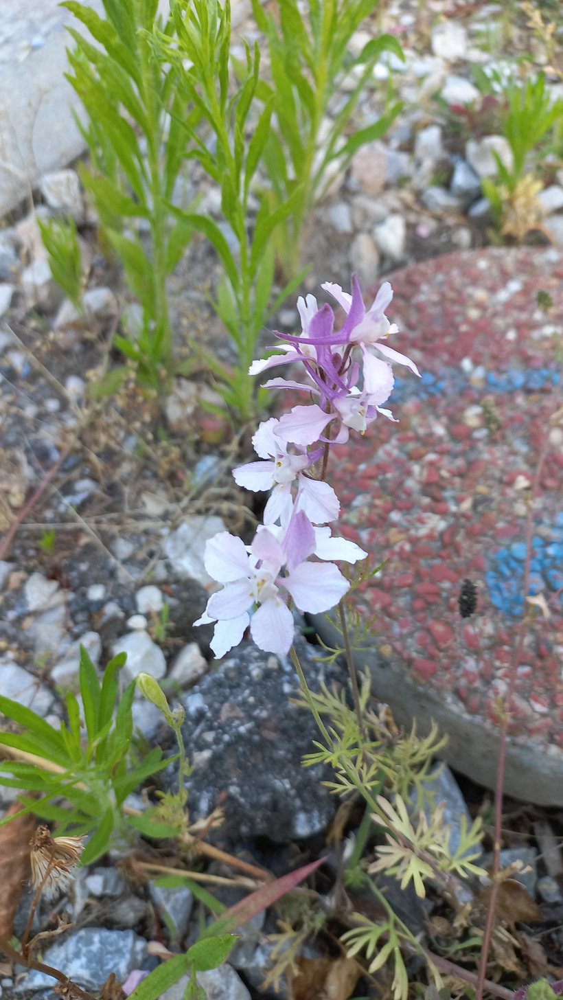

# Ostrôžka záhradná
- Lat.: Consolida ajacis
- En.: Rocket larkspur

Čeľaď: Iskerníkovité (Ranunculaceae)

- Rastie najmä v Európe
- Celá rastlina je toxická
- Výška: 30cm

Zdr.:
- https://plants.usda.gov/home/plantProfile?symbol=COAJ
- https://www.eol.org/pages/489635
- https://www.sarahraven.com/products/consolida-dark-blue
- https://www.gbif.org/species/3033830
