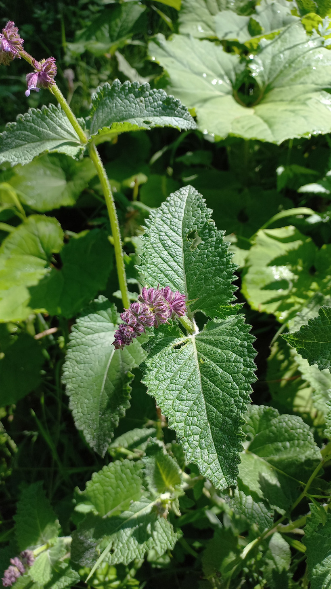

# Šalvia praslenatá
- Lat.: Salvia verticillata
- En.: Lilac sage

Čeľaď: Hluchavkovité (Lamiaceae)

- Pôvodom z oblasti stredomoria
- Rastie na vyslnených trávnatých lúkach
- Má veľa nektáru - z čistého porastu by sa dalo získať 500kg medu/hektár

Zdr.:
- https://www.nahuby.sk/atlas-rastlin/Salvia-verticillata/salvia-praslenata/salvej-preslenita/ID7864
- https://botany.cz/cs/salvia-verticillata/