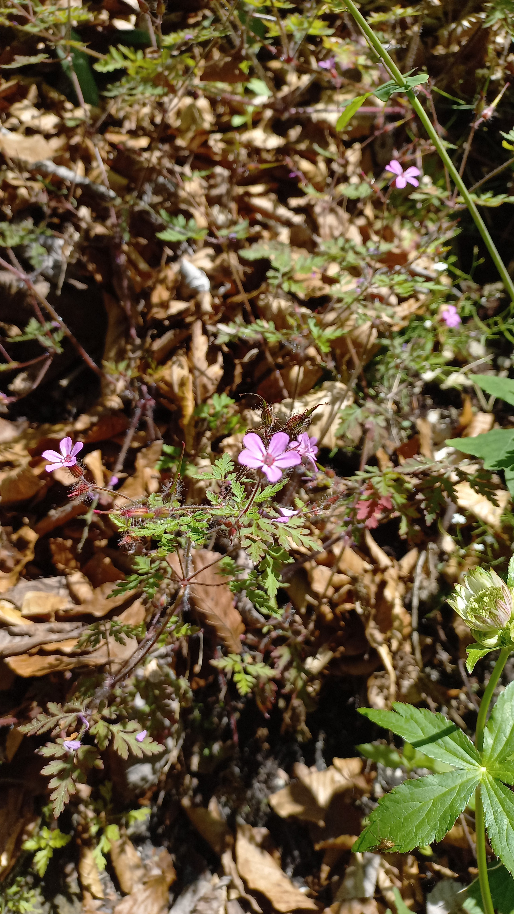

# Pakost purpurový
- Lat.: Geranium purpureum
- En.: Little Robin

- 20-30cm bylina
- 5-početné listy
- Rastie pri kolajiskách, štrkových násypoch, pri stenách apod.

Zdr.:
- https://www.first-nature.com/flowers/geranium-purpureum.php
- https://www.nahuby.sk/atlas-rastlin/Geranium-purpureum/pakost-purpurovy/kakost-purpurovy/ID13778