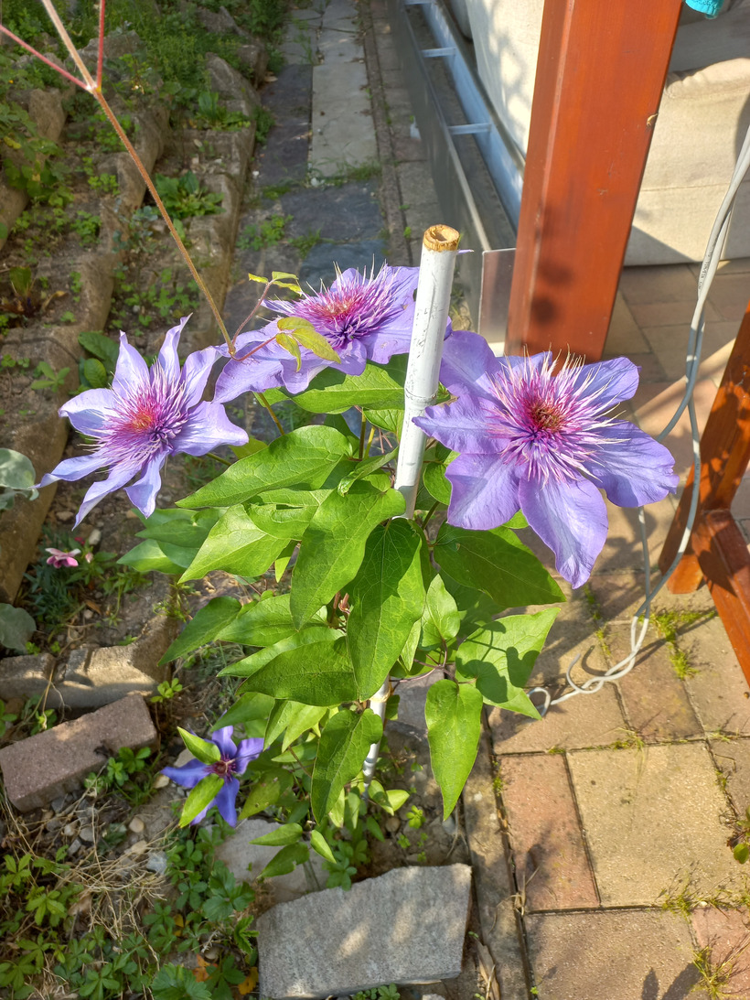

# Plamienok vlašský
- Lat.: Clematis viticella
- En.: Purple clematis

Čeľaď: Iskerníkovité (Ranunculaceae)

- Popínavá trvalka
- Má až 300 odrôd
- Dorastá až 4 metre

Zdr.:
- https://mojerastliny.sk/plamienok/