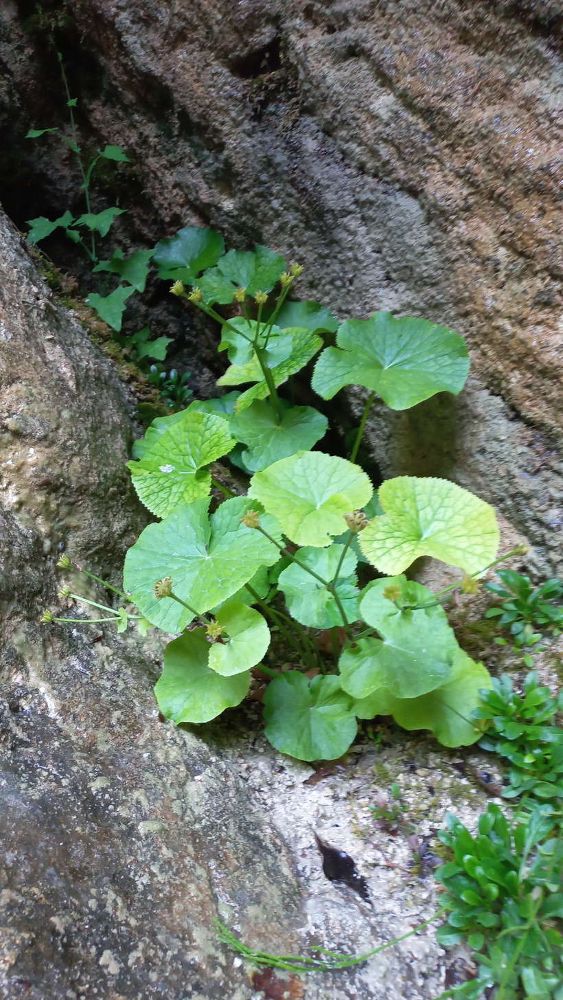

# Záružlie močiarne
- Lat.: Caltha palustris
- En.: Marsh marigold

- Močiarna rastlina
- Dorastá 20-40cm
- Darí sa jej na slnečných miestach

Zdr.:
- https://www.aquagarden.sk/obchod/caltha-palustris-zaruzlie-mociarne/p-4149689.xhtml