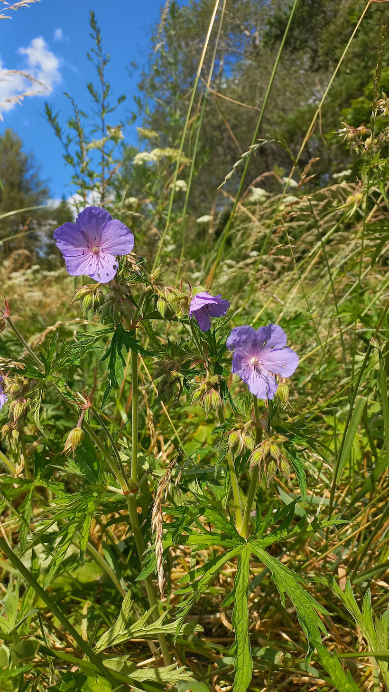

# Pakost lúčny
- Lat.: Geranium pratense   
- En.: Meadow crane's bill

Čeľaď: Geraniaceae

- Lúčna trvalka
- Preferuje slnečné stanoviská
- Rastie v zásaditej živinatej pôde

Zdr:
- https://www.rastlinky.sk/geranium-pratense-pakost-lucny-k9.html
- https://www.nahuby.sk/atlas-rastlin/Geranium-pratense/pakost-lucny/kakost-lucni/ID8669