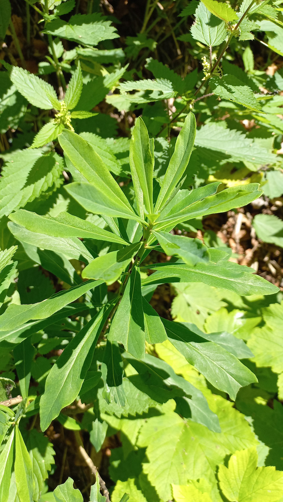

# Lykovec jedovatý
- Lat.: Daphne mezereum
- En.: Mezereon

Čeľaď: Thymelaeaceae

- Opadavý ker
- Jedovatý
- Voňavé kvety
- Výrazné červené bobule

Zdr:
- https://www.zahrada-sk.com/e/sk/00281-daphne-mezereum-lykovec-jedovat%C3%BD/
- https://www.nahuby.sk/atlas-rastlin/Daphne-mezereum/lykovec-jedovaty/lykovec-jedovaty/ID7468