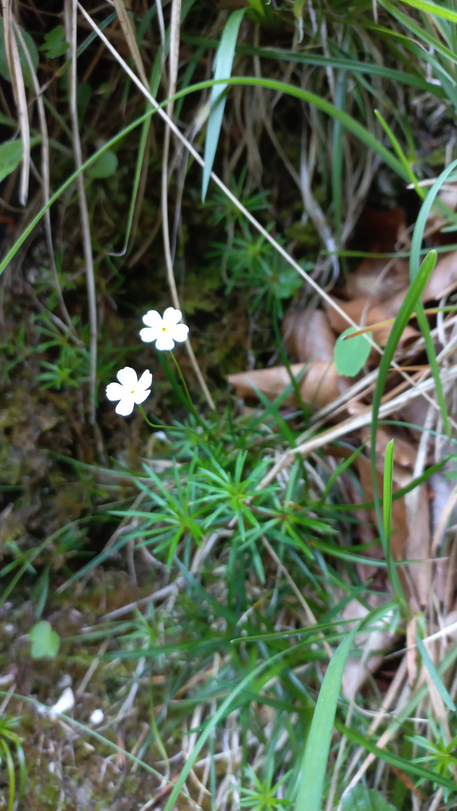

# Pochybok biely
- Lat.:
- En.: Milkwhite rock jasmine

Čeľaď: Primulaceae

- 3-15cm trváca bylina
- Rastie v horách strednej a juhovýchodnej Európy
- Obľubuje vápencové skaly

Zdr.:
- https://www.nahuby.sk/atlas-rastlin/Androsace-lactea/pochybok-biely/pochybek-mlecny/ID7654
- https://botany.cz/cs/androsace-lactea/