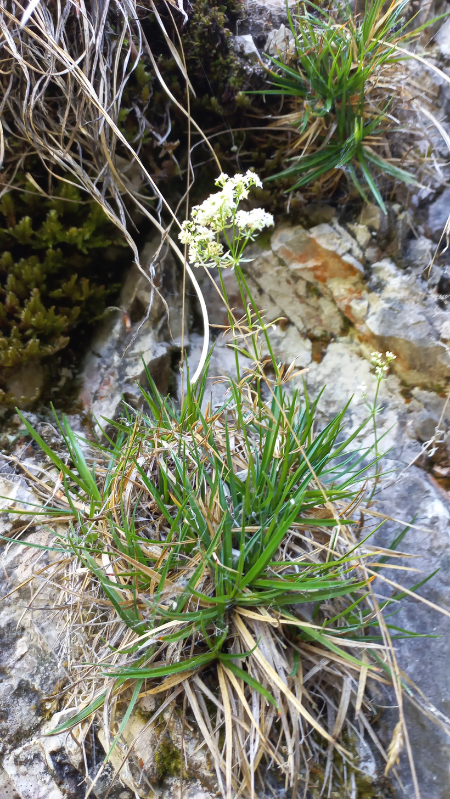

# Lipkavec svetlý
- Lat.: Galium lucidum
- En.: Galium lucidum

Čeľaď: Rubiaceae

- 30cm bylina
- Rastie vo všetkých typoch pôd
- Tenké <2mm listy

Zdr:
- https://www.biolib.cz/cz/taxon/id244245/
- https://www.florealpes.com/fiche_galiumlucidum.php