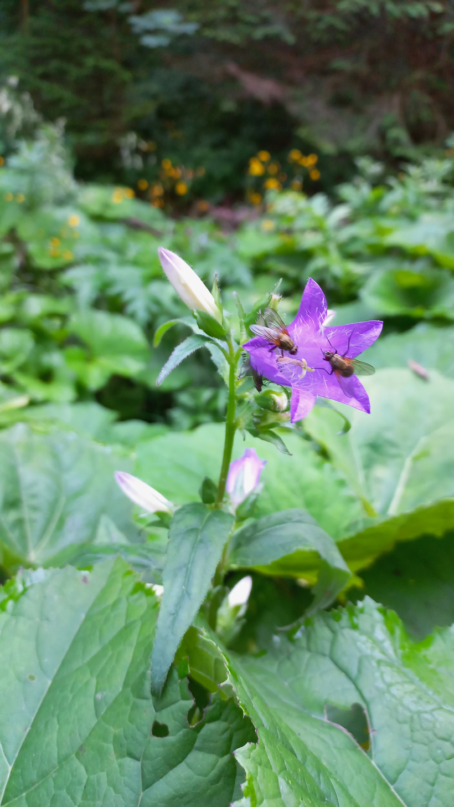

# Zvonček pŕhľavolistý
- Lat.: Campanula trachelium
- En.: Nettle-leaved Bellflower

Čeľaď: Zvončekovité (Campanulaceae)

- Trváca 30-90cm bylina
- Rastie na okrajoch lesov
- Charakteristické fialové kvety v súvetiach

Zdr.:
- https://www.zahradnictvospomysl.sk/zvoncek-prhlavolisty-campanula-trachelium/
- https://botany.cz/cs/campanula-trachelium/