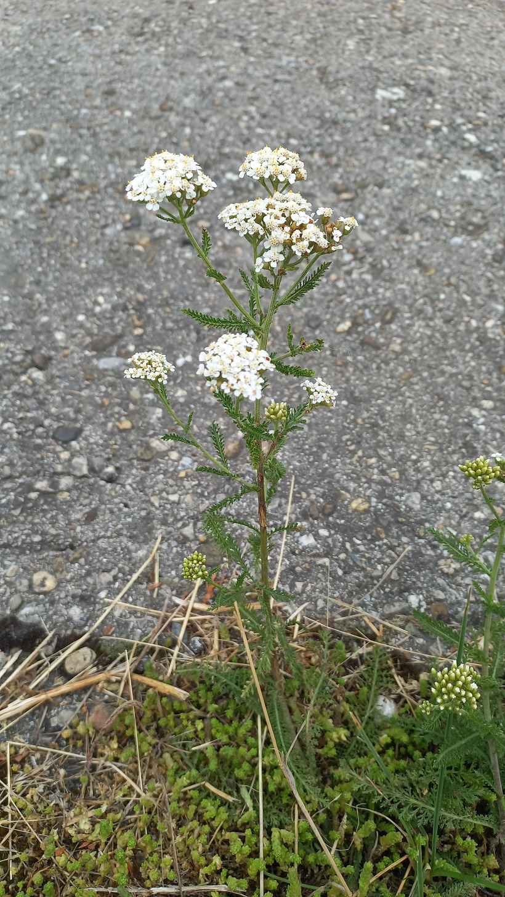

# Rebríček vznešený
- Lat.: Achillea nobilis
- En.: 

Čeľaď: Astrovité (Asteraceae)

- Výskyt: Juhovýchodná časť strednej Európy
- Rastie v suchých trávnikoch, na okrajoch lesov a ciest
- Silno voňavá bylina
- Stonky zvyčajne nerozvetvené

Zdr:
- https://www.slovakiana.sk/kulturne-objekty/cair-ko24hb2
- https://www.nahuby.sk/atlas-rastlin/Achillea-nobilis/rebricek-vzneseny/rebricek-slicny/ID9761
- https://botany.cz/cs/achillea-nobilis/